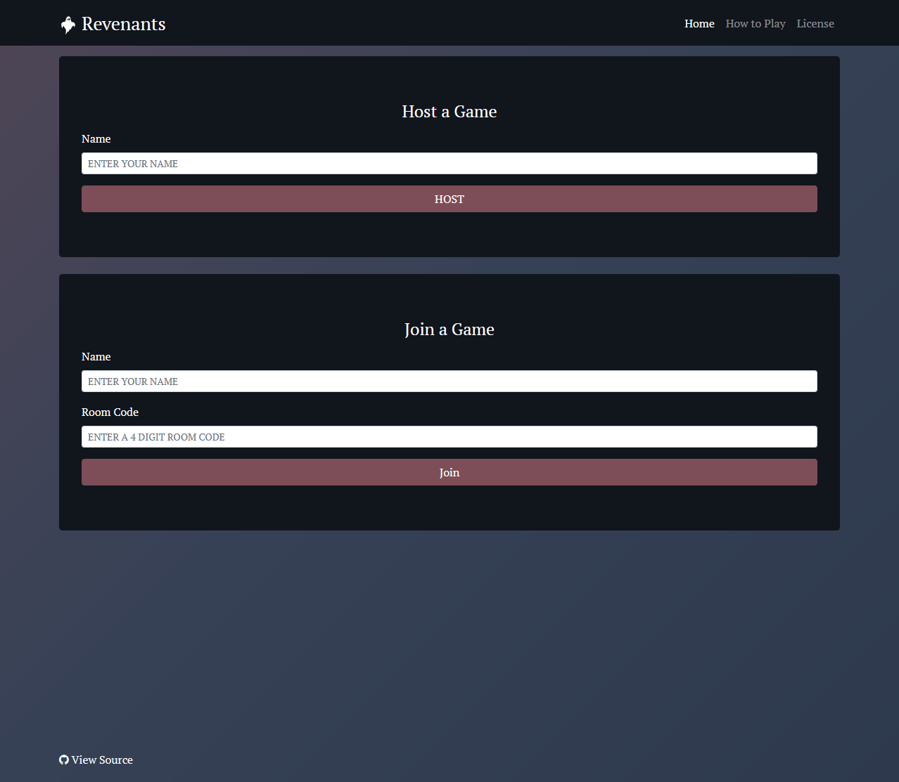

## Revenants
[](https://revenants.kylelierer.com/)
[](https://github.com/Kyle-L/Revenants/commits/master)
##

- [Overview](#overview)
- [Media](#media)
- [Play](#play)
- [Requirements](#requirements)
- [Setup](#setup)
- [License](#license)

<a name="overview"/></a>
## Overview
This repository is for the development of a web application game similar  to that of the classic card game Mafia. 

<a name="media"/></a>
## Media


<a name="play"/></a>
## Play
You can play the game at [revenants.kylelierer.com](https://revenants.kylelierer.com/) or by scanning the following QR Code...


<a name="requirements"/></a>
## Requirements
- [ ] Git
- [ ] Python 3.7.3
- [ ] PostgreSQL
- [ ] An IDE of your choice

<a name="setup"/></a>
## Local Setup
1. Clone the repository.
```
$ git clone git@github.com:Kyle-L/Revenants.git
```

2. Check into the cloned repository.
```
cd Revenants/app
```

3. Install Pipenv using pip, install pip if you haven't already.
```
pip install pipenv
```

4. Setup a virtual environment with Pipenv.
```
$ python3 -m venv env
```

5. Start the virtual environment
```
$ source env/bin/activate
```

6. Install the requirements
```
$ pip3 install -r requirements.txt
```

9. Run the server.
```
$ gunicorn --worker-class eventlet -w 1 run:app
```

## Heroku Deployment
1. Fork this repository.

2. Create a new Heroku project

3. Create a new PostgresSQL database resource for the forked repository.

4. Under the deployment tab, login into Github and choose the forked repository to deploy from.

5. Deploy!


<a name="license"></a>
## License
[](LICENSE)
